# Taco y Tequila
Taco y Tequila is mexican website, for users to purchase meal kits and also some side items like alcohol, spices, sauces etc. The user can also book the restaurant for an event.

- There are two types of users
    - An admin(administrator) user account
    - A regular(shopper) user account
    - When making a payment as a regular user, a test credit card of 4242424242424242 has been set up for the card number
    - For the expiry date, cvc and postal code any series number(s) can be used(once they meet the mimimum values)
<br>


# Table of Contents

# Project Overview

- This project was built for the submission of my 4th project with code institute - Diploma in software development (Full Stack)
- The repository on GitHub that contains the website source code and assets is available at the following url: [Code Repository](https://github.com/GethinDavies1990/CI_MS4_DTR)
- The website was built with a responsive look and feel for desktop, tablet and mobile devices

# UX
## Strategy
### Primary Goal
The primary goal of the website from the site
owners perspective is as follows:
- To add, edit and delete products with the relevant information (price, description, spice rating, image, sizes and category) on the website
- To allow a user make a purchase of the products on the website
- To categorise sale items on the website
- To allow the user to book events on the website

The primary goal of the website from a site users perspective is as follows:
- To register for an account on the website and receive an email after successful registration
- To login or logout from the website
- To easily recover my password in case I forget it
- Have a personalised user profile with my delivery, payment information and order history
- View a list of products on the website
- View an individual product detail(price, description, spice rating, image, sizes and category)
- To add an item to a shopping bag, and select the quantity and size if applicable
- Complete a purchase of items in a shopping bag
- To sort the list of available products by spice rating, price and category
- Search for a product by name or description and view the search results
- To book events

## Structure
### Website pages
- I have structured the websote into over (INSERT NUMBER OF PAGES HERE), each with clear structure, information and purpose. I sued Bootstrap throughout, which gave consistent structure and responsive design.
- Below are the main pages'/features
- These pages are descrived in more detail in the user stories section.

(INSERT TABLE OF PAGES HERE)


### Code Structure
The project is divided into a number of apps, as is built using the Django Framework
The project was built on the Boutique Ado project, that was part of the project content
The apps are described as follows
- bag (part of the original Boutique Ado project): This app contains functionality regarding a users shopping bag
- checkout (part of the original Boutique Ado project): This app contains functionality regarding a users checking out and payment of an order
- events: This app allows users to book the restaurant for an event.
- home (part of the original Boutique Ado project): This app contains functionality regarding the users home page
- info: This includes functionality for the meet the team section of the website
- products (part of the original Boutique Ado project): This app contains functionality regarding a product.
- profiles (part of the original Boutique Ado project): This app contains functionality regarding a users profile and order history

To complement the apps there are
- taco_y_tequila: Containing settings.py(Settings) and urls.py(Website urls) for example
- templates: Containing the base.html, allauth(django authentication) and includes html files
- static: Base css
- manage.py: Main python file for starting the website
- README.md: Readme documentation
- TESTING.md: Testing documentation
- custom_storage.py: AWS Boto3 configuration
- Procfile: To run the application
- Requirements.txt: Containing the python libraries installed
Note: Environment variable values are not exposed in the source code, they are stored locally in env.py that is not checked in(and listed in .gitignore, and on Heroku in app settings

### Database
- The website is a data-centric one with html, javascript, css used with the bootstrap framework as a frontend
- The backend consists of Python built with the Django framework with a database of a Postgres for the deployed Heroku version(production)
- Postgres is a powerful, open source object-relational database system (https://www.postgresql.org/)
- A SQLLite database was used for local development (https://www.sqlite.org/index.html)

#### Physical database model
This model contains all fields stored in the database collections with their data type and mimics the structure of what is actually stored in the Postgres database
<br>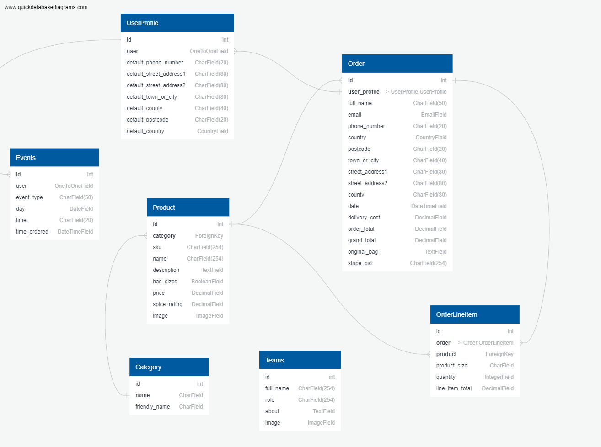

#### Models
- The following models were created to represent the database model structure for the website
##### Order Model
- The Order model contains information about orders made on the website.
- It contains UserProfile as a foreign-key.
- The model contains the following fields: order_number, user_profile, full_name, email, phone_number, country, postcode, town_or_city, street_address1
, street_address2, county, date, delivery_cost, order_total, grand_total, original_bag, stripe_pid
##### OrderLineItem Model
- The OrderLineItem model contains information about an entry in an order, for orders made on the website.
- It contains Order and Product as foreign-keys.
- The model contains the following fields: order, product, product_size, quantity, lineitem_total
##### Product Model
- The Product Model represents a product and its details
- It contains Category as a foreign-key
- The model contains the following fields: category, sku, name, description, has_sizes, price, spice_rating, image
- The image field contains the product image
##### UserProfile Model
- The UserProfile model has a one-to-one relationship with User
- The model contains the following fields: default_phone_number, default_street_address1, default_street_address2
default_town_or_city, default_county, default_postcode and default_country
##### Events Model
- The Events Model contains the information to book an event
- The model contains the following fields: user, event_type, date, time, time_ordered
##### Team Model
- The Team Model represents the members of staff currently employed by the restaurant
- The model contains the following fields: name, role, about, image
##### Category Model
- The Category model contains a product category
- it contains the following fields: name, friendly name

## Scope
There is overlap in terms of user stories for the two types of users, and they are described below
### User Stories Potential or Existing Customer
The user stories for the regular user eg: "shopper user" (a potential or existing customer) are described as follows:
- User Story 1.1: As an admin/regular user the navigation bar is displayed with a logo on all pages with a search box, My account and shopping bag icons on a desktop device
- User Story 1.2: As an admin/regular user the navigation bar is displayed on all pages with a search box, My account and shopping bag icons on a mobile/tablet device
- User Story 1.3: As a regular user not logged in, I see a Register/Login link under the My Account dropdown
- User Story 1.4: As a regular user logged in/not logged in, I am brought to my shopping bag if I click on the Bag icon
- User Story 1.5: As a regular/admin user logged in, I see a "My Profile"/Logout under the My Account dropdown
- User Story 1.6: As a regular/admin user logged in, if I click on the My Profile under My Account I am brought to the My Profile page
- User Story 1.7: As a regular/admin user logged in, if I click on the My Profile under My Account I am brought to the Logout page. If I click Logout I am Logged out. If I click cancel I am brought back to the homepage
- User Story 1.8: As a regular/admin user I can view the Home link in the header, and clicking it will bring the user to the homepage
- User Story 1.9: As a regular/admin user I can click on the "All Products" filter, click By Price, and will be brought to the Products page, with products price low to high displayed
- User Story 1.10: As a regular/admin user I can click on the "All Products" filter, click By Rating, and will be brought to the Products page, with products rating high to low displayed
- User Story 1.11: As a regular/admin user I can click on the "All Products" filter, click By Category, and will be brought to the Products page, with products category a-z displayed
- User Story 1.12: As a regular/admin user I can click on the "Meal Kits" filer and filter by Mild, Medium, Hot, Very Hot, All Meal Kits
- User Story 1.13: As a regular/admin user I can click on the "Drinks" filter and filter by Tequila, Soft Drinks, Beers, All Drinks
- User Story 1.14: As a regular/admin user I can click on the "Sauces & Spices" filter and filter by Sauces, Spices
- User Story 1.15: As a regular/admin user I can click on the "Events" Tab and be directing to the events booking page.
- User Story 1.16: As a regular/admin user if I encounter an error on the site, I will be navigated to the applicable 400, 403, 404 or 500 error page
- User Story 2.1: As a regular user the footer is displayed with a logo, 'About us links', 'Events' and 'Newsletter' sign up
- User Story 2.2: As a regular user I can sign up for a newsletter by entering my email address and clicking Signup. I will receive an email after signing up
- User Story 3.1: As a regular user I can register on the website by providing an email address, email address(confirmation), username, password, password confirmation
- User Story 3.1: As a regular user I will receive an email to verify my account after registering
- User Story 3.1: As a regular user I can log in to my account once I click on the verification link in the email I receive regarding my registration
- User Story 4.1: As an admin/regular user I can log in to the website using my username or email address and password. Both fields are mandatory. Once correct, I will be navigated to the homepage and a message displayed
- User Story 4.2: As an admin/regular user I can request a new password if I forget my current password. I will receive an email to reset my password. Once I reset I can log in
- User Story 5.1: As a regular user I can view the products page with product count and with each product image, title, spice rating, category the product is in.
- User Story 5.2: As a regular user I can sort the products by Price(high to low, low to high), Spice Rating(high to low, low to high), Name(A-Z, Z-A), Category(A-Z, Z-A)
- User Story 5.3: As a regular user if I click on a product I will be navigated to the product detail page
- User Story 5.4: As a regular user I can view the product image, description, sku, spice rating, category
- User Story 5.5: As a regular user I can click on the Keep Shopping button on the product detail page, and it will navigate the user to the products page
- User Story 5.6: As a regular user I can set the product size(if applicable for the product) and quantity for a product (one plus)
- User Story 6.1: As a regular user I can view my Default delivery information: Phone Number, Street Address 1, Street Address 2, Town or City, County, State or Locality, Postal Code and Country
- User Story 6.2: As a regular user I can update my Default delivery information: Phone Number, Street Address 1, Street Address 2, Town or City, County, State or Locality, Postal Code and Country
- User Story 6.3: As a regular user I can view my order history(Order Number, Date, Items and Order Total)
- User Story 6.4: As a regular user I can click on an order number to view the order information (Order number, Order date/time, Full Name, Street Address 1, Street Address 2, Town or City, County, State or Locality, Postal Code and Country, Phone Number, Order Total, Deliver, Grand Total)
- User Story 7.1: As a regular user I can click on a product, set the size(if applicable) and quantity, click Add to Bag and the product will be added to my bag, a message displayed, and a toast will be displayed with the bag contents
- User Story 7.2: As a regular user I can click on the bag icon, I will be brought to my bag. If there are no items in the bag, a message will be displayed
- User Story 7.3: As a regular user I can click on the bag icon, I will be brought to my bag. If there are items, the product image, detail, price, quantity, subtotal will be displayed for the item. The bag total, delivery(if applicable), grand total would be displayed
- User Story 7.4: As a regular user I can update the quantity or remove an item from my shopping bag
- User Story 7.5: As a regular user I can click on the Secure Checkout button on the bag page or toast message, and I will be brought to the Checkout page
- User Story 7.6: As a regular user on the checkout page I can set my details(Full Name, email address, both mandatory) and Delivery Information(Phone Number(mandatory), Street Address 1(mandatory), Street Address 2, Town or City(mandatory, County, State or Locality, Postal Code and Country(mandatory), which is populated from my profile if filled in
- User Story 7.7: As a regular user on the checkout page I can view the order summary(item image, title, size, quantity, subtotal, order total, delivery, grand total)
- User Story 7.8: As a regular user on the checkout page if the order total is greater than 75 Pounds there is no delivery charge
- User Story 7.9: As a regular user on the checkout page if the order total is less than 75 pounds, there is delivery charge(5% of the order total) A message is displayed to the user on the toast message of what they need to add to the bag to avail of no delivery charge
- User Story 7.10: As a regular user on the checkout page if I click "Save this delivery information to my profile", the details entered will be saved on the users profile
- User Story 7.11: As a regular user on the checkout page I can enter a credit card number(16 digits), expiry date(2 digits/2digits) and a postal code(up to 5 digits), these fields are mandatory
- User Story 7.12: As a regular user on the checkout page if I click the Keep Shopping button I will be navigated to the products page
- User Story 7.13: As a regular user on the checkout page if I click the Complete Order button, and the transaction is not successful, a message will be displayed
- User Story 7.14: As a regular user on the checkout page if I click the Complete Order button, and the transaction is successful, the user will be navigated to a checkout success page, and an email is sent to the user
- User Story 7.15: As a regular user on the checkout page if I click the Complete Order button, and the transaction is successful, the order is saved to my order history in My profile page
- User Story 7.16: As a regular user on the checkout success page, the Order details will be displayed (Order number, Order date/time, Full NameStreet Address 1, Street Address 2, Town or City, County, State or Locality, Postal Code and Country, Phone Number, Order Total, Deliver, Grand Total) and a link to the sales item page is displayed
- User Story 7.17: As a regular user not logged in, I can add items to my bag and make a purchase

### User Stories Website Owner
The user stories for the regular user eg: "shopper user" (a potential or existing customer) are described as follows:
- User Story 1.1: As an admin/regular user the navigation bar is displayed with a logo on all pages with a search box, My account and shopping bag icons on a desktop device
- User Story 1.2: As an admin/regular user the navigation bar is displayed on all pages with a search box, My account and shopping bag icons on a mobile/tablet device
- User Story 1.3: As a regular user not logged in, I see a Register/Login link under the My Account dropdown
- User Story 1.4: As a regular user logged in/not logged in, I am brought to my shopping bag if I click on the Bag icon
- User Story 1.5: As a regular/admin user logged in, I see a "My Profile"/Logout under the My Account dropdown
- User Story 1.6: As a regular/admin user logged in, if I click on the My Profile under My Account I am brought to the My Profile page
- User Story 1.7: As a regular/admin user logged in, if I click on the My Profile under My Account I am brought to the Logout page. If I click Logout I am Logged out. If I click cancel I am brought back to the homepage
- User Story 1.8: As a regular/admin user I can view the Home link in the header, and clicking it will bring the user to the homepage
- User Story 1.9: As a regular/admin user I can click on the "All Products" filter, click By Price, and will be brought to the Products page, with products price low to high displayed
- User Story 1.10: As a regular/admin user I can click on the "All Products" filter, click By Rating, and will be brought to the Products page, with products rating high to low displayed
- User Story 1.11: As a regular/admin user I can click on the "All Products" filter, click By Category, and will be brought to the Products page, with products category a-z displayed
- User Story 1.12: As a regular/admin user I can click on the "Meal Kits" filer and filter by Mild, Medium, Hot, Very Hot, All Meal Kits
- User Story 1.13: As a regular/admin user I can click on the "Drinks" filter and filter by Tequila, Soft Drinks, Beers, All Drinks
- User Story 1.14: As a regular/admin user I can click on the "Sauces & Spices" filter and filter by Sauces, Spices
- User Story 1.15: As a regular/admin user I can click on the "Events" Tab and be directing to the events booking page.
- User Story 1.16: As a regular/admin user if I encounter an error on the site, I will be navigated to the applicable 400, 403, 404 or 500 error page
- User Story 2.1: As a regular user the footer is displayed with a logo, 'About us links', 'Events' and 'Newsletter' sign up
- User Story 2.2: As a regular user I can sign up for a newsletter by entering my email address and clicking Signup. I will receive an email after signing up
- User Story 3.1: As a regular user I can register on the website by providing an email address, email address(confirmation), username, password, password confirmation
- User Story 3.1: As a regular user I will receive an email to verify my account after registering
- User Story 3.1: As a regular user I can log in to my account once I click on the verification link in the email I receive regarding my registration
- User Story 4.1: As an admin/regular user I can log in to the website using my username or email address and password. Both fields are mandatory. Once correct, I will be navigated to the homepage and a message displayed
- User Story 4.2: As an admin/regular user I can request a new password if I forget my current password. I will receive an email to reset my password. Once I reset I can log in
- User Story 5.10: As an admin user I can view the Add product page by clicking on the Product Management link.
- User Story 5.11: As an admin user I can view the Edit product page by clicking on the Edit button on the product.
- User Story 5.12: As an admin user I can click on a product, and I am navigated to the product detail page. I can edit or delete the product by clicking on the Edit or Delete links on the page
- User Story 5.13: As an admin user I can delete a review a regular user has added
    - User Story 8.1: As an admin user I can add a product by clicking on the Product Management link in My Account. I must enter a name, category, price, sku, description, and image
- User Story 8.2: As an admin user I can edit a product by clicking on the Edit button on the Products page for the product. I can update the name, category, price, sku, description, has Sizes(Unknown, Yes, No), Spice Rating, update an image and click the Edit Product button. Clicking cancel navigates the user to the product page
- User Story 8.3: As an admin user I can delete a product by clicking on the Delete button on the product. A modal will appearing asking to confirm, and a message displayed once I confirm.
- User Story 9.1: As an admin user I can view users orders in the django admin page and can view order number, date, full name, order total, delivery cost, grand total
- User Story 9.2: As an admin user I can view users orders in the django admin page and can search by order number, full name and filter by order number, full name and order date
- User Story 9.3: As an admin user I can view products in the django admin page and can view a products code, name, category, has sizes, price, presale price, spice rating, image
- User Story 9.4: As an admin user I can view products in the django admin page and can view search and filter by code, category, name and price
- User Story 9.5: As an admin user I can view users in the django admin page and can view their username, email address, first name, last name, staff status
- User Story 9.6: As an admin user I can view users in the django admin page and can search by username and email address and  filter by staff status, superuser status and active status
- User Story 9.7: As an admin user I can view categories in the django admin page and can view a category name and friendly name

## Skeleton
### Wireframes
Each wireframe image below contains three sub images, one for desktop, tablet and mobile
Figma was used to create the wireframes

Page | Wireframe |
------------ | -------------
bag/templates/bag/bag.html | [Desktop/Tablet/Mobile](readme/wireframes/bag.png)
checkout/templates/checkout/checkout.html | [Desktop/Tablet/Mobile](readme/wireframes/checkout.png)
checkout/templates/checkout/checkout_success.html | [Desktop/Tablet/Mobile](readme/wireframes/checkout_success.png)
home/templates/home/index.html | [Desktop/Tablet/Mobile](readme/wireframes/index.png)
products/templates/products/add_product.html | [Desktop/Tablet/Mobile](readme/wireframes/add_product.png)
products/templates/products/edit_product.html | [Desktop/Tablet/Mobile](readme/wireframes/edit_product.png)
products/templates/products/product_detail.html | [Desktop/Tablet/Mobile](readme/wireframes/product_detail.png)
products/templates/products/products.html  | [Desktop/Tablet/Mobile](readme/wireframes/products.png)
profile/templates/profile/profile.html | [Desktop/Tablet/Mobile](readme/wireframes/profile.png)
profile/templates/profile/order_history.html | [Desktop/Tablet/Mobile](readme/wireframes/order_history.png)
templates/allauth/account/login.html | [Desktop/Tablet/Mobile](readme/wireframes/login.png)
templates/allauth/account/logout.html | [Desktop/Tablet/Mobile](readme/wireframes/logout.png)
templates/allauth/account/register.html| [Desktop/Tablet/Mobile](readme/wireframes/register.png)

## Surface
### Color Palette
I have gone for a simple and minimal design for the website, with 2 shades of green, and a bright blue to add some pop to the website, I used ColorHunt to suggest some colour themes, then used Adobe color to check these colours for accessibility. I stored these in the root folder as variables which allowed me to quickly play around with some colours and looks.
<code>
<br>
```
:root {
    --main-color: #cce293; 
    --main-color-sec: #40724e;
    --text-main: #0C1829;
    --block-main: #22A699;
  }
  ```
<br>
</code>
<br>

 --main-color: #cce293;
<br>

 --main-color: #40724e;
<br>

 --main-color: #0C1829;
<br>

 --main-color: #22A699;
<br>


### Typography
The Paytone One is the main font used throughout the whole website with Sans Serif as the fallback font in case for any reason the Paytone One font cannot be imported into the website correctly. This font is from the Google fonts library. For the secondary font I used Comfortaa, which is also from the google fonts library.
<br>

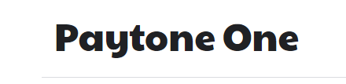
<br>

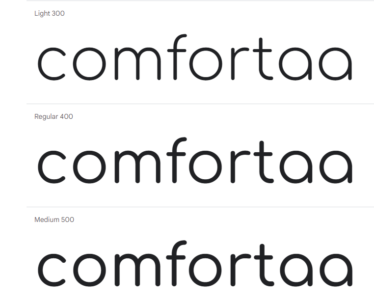

# Features
The website has twenty distinct features, and they are described below
What is important to detail is what pages are accessible by the three types of users
1. A user not logged into the site
2. A regular(shopper) user logged into the site
3. An admin(administrator) user

 Nav Link              |Not logged in  |Logged in as regular user|Logged in as admin
:-------------         |:------------- |:----------------|:------------- |
Home     |&#9989;        |&#9989;          |&#9989; |
Products           |&#9989;        |&#9989;          |&#9989; |
Product Detail           |&#9989;        |&#9989;          |&#9989; |
Product Management(Add Product)     |&#10060;       |&#10060;         |&#9989; |
Product Management(Edit Product)     |&#10060;       |&#10060;         |&#9989; |
Product Management(Delete Product)     |&#10060;       |&#10060;         |&#9989; |
My Profile             |&#10060;       |&#9989;          |&#9989; |
Order History         |&#10060;       |&#9989;          |&#9989; |
Log out               |&#10060;       |&#9989;          |&#9989; |
Register               |&#9989;        |&#10060;         |&#10060; |
Log in               |&#9989;        |&#10060;         |&#10060; |
Bag |&#9989;        |&#9989;          |&#9989; |
Checkout |&#9989;        |&#9989;          |&#9989; |
Checkout success |&#9989;        |&#9989;          |&#9989; |

## Existing Features
The screenshots below show mainly desktop images, the tablet and mobile images are displayed in the TESTING.MD file for each feature/user story
### Feature 1 Navigation Bar and Homepage
#### Description feature 1
- The homepage consists of a hero image and a call to action to look at the products for sale, a header/nav bar and footer
- The header and footer is consistent across all pages
- The navigation bar is displayed with a logo on all pages with a search box, My account, and shopping bag icons on a desktop device
<br>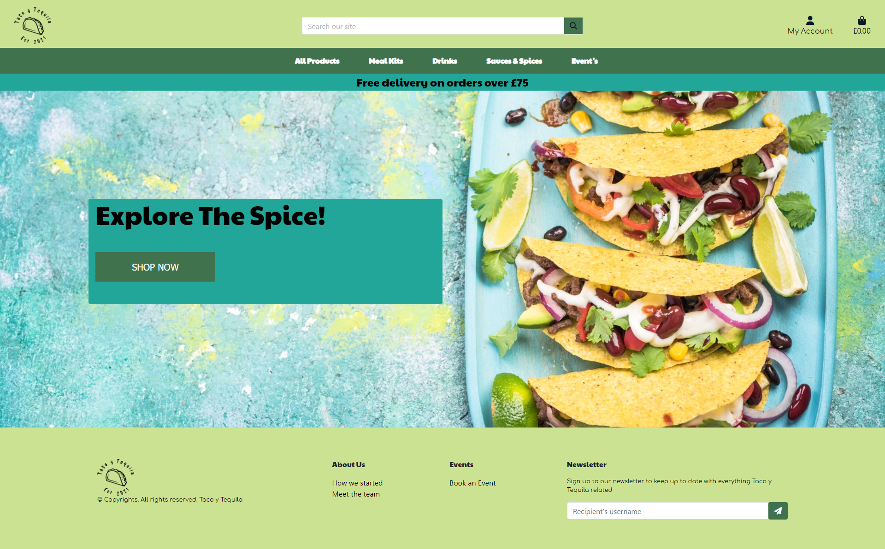
The website links in the footer are the same for all users
<br>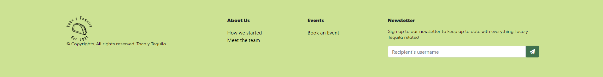
- The navigation bar is displayed on all pages with a search box, My account, and shopping bag icons on a Desktop device
<br>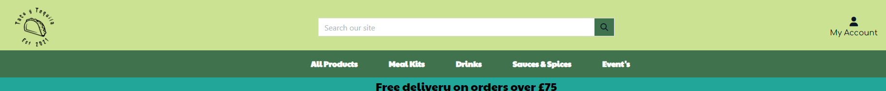
- A regular user logged in, I see a "My Profile"/Logout under the My Account dropdown
- An admin user logged in, I see a Product Management/My Profile/Logout under the My Account dropdown
<br>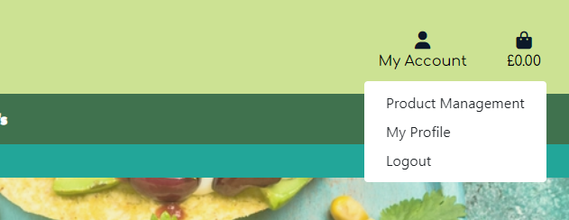
- On a desktop device there is a number of filters described below: All Products, Meal Kits, Drinks, Sauces & Spices, Event's
<br>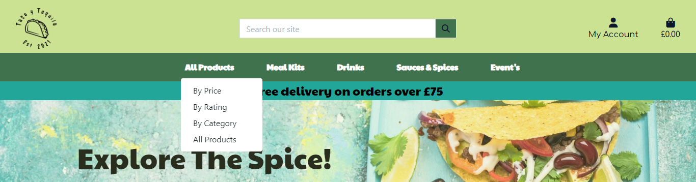
- If a user encounters an error, the relevant error page is displayed (400, 403, 404 or 500)
<br>


#### User Stories feature 1
- User Story 1.1: As an admin/regular user the navigation bar is displayed with a logo on all pages with a search box, My account and shopping bag icons on a desktop device
- User Story 1.2: As an admin/regular user the navigation bar is displayed on all pages with a search box, My account and shopping bag icons on a mobile/tablet device
- User Story 1.3: As a regular user not logged in, I see a Register/Login link under the My Account dropdown
- User Story 1.4: As a regular user logged in/not logged in, I am brought to my shopping bag if I click on the Bag icon
- User Story 1.5: As a regular/admin user logged in, I see a "My Profile"/Logout under the My Account dropdown
- User Story 1.6: As a regular/admin user logged in, if I click on the My Profile under My Account I am brought to the My Profile page
- User Story 1.7: As a regular/admin user logged in, if I click on the My Profile under My Account I am brought to the Logout page. If I click Logout I am Logged out. If I click cancel I am brought back to the homepage
- User Story 1.8: As a regular/admin user I can view the Home link in the header, and clicking it will bring the user to the homepage
- User Story 1.9: As a regular/admin user I can click on the "All Products" filter, click By Price, and will be brought to the Products page, with products price low to high displayed
- User Story 1.10: As a regular/admin user I can click on the "All Products" filter, click By Rating, and will be brought to the Products page, with products rating high to low displayed
- User Story 1.11: As a regular/admin user I can click on the "All Products" filter, click By Category, and will be brought to the Products page, with products category a-z displayed
- User Story 1.12: As a regular/admin user I can click on the "Meal Kits" filer and filter by Mild, Medium, Hot, Very Hot, All Meal Kits
- User Story 1.13: As a regular/admin user I can click on the "Drinks" filter and filter by Tequila, Soft Drinks, Beers, All Drinks
- User Story 1.14: As a regular/admin user I can click on the "Sauces & Spices" filter and filter by Sauces, Spices
- User Story 1.15: As a regular/admin user I can click on the "Events" Tab and be directing to the events booking page.
- User Story 1.16: As a regular/admin user if I encounter an error on the site, I will be navigated to the applicable 400, 403, 404 or 500 error page

### Feature 2 Footer
#### Description feature 2
- A footer is displayed at the bottom of the page
- The footer also contains a logo, some text, links to the 'About us' and 'Events' pages and a 'Newsletter' Sign Up
- A user can sign up for the mailing list by entering their email and clicking the "Signup" button
<br>
#### User Stories feature 2
- User Story 2.1: As a regular user the footer is displayed with a logo, 'About us links', 'Events' and 'Newsletter' sign up
- User Story 2.2: As a regular user I can sign up for a newsletter by entering my email address and clicking Signup. I will receive an email after signing up

### Feature 3 Register
#### Description feature 3
- A regular user can register for an account.
- The user must provide a valid email address, email address(confirmation), username, password, password confirmation
<br>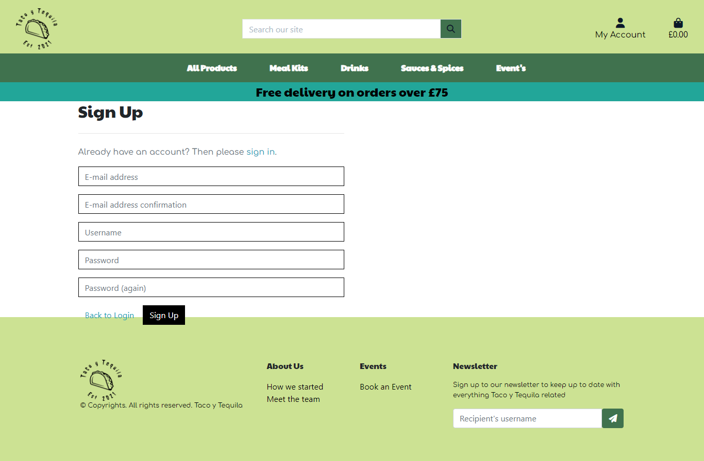
- These 5 fields are  mandatory and a user cannot register the same details twice for an account
<br>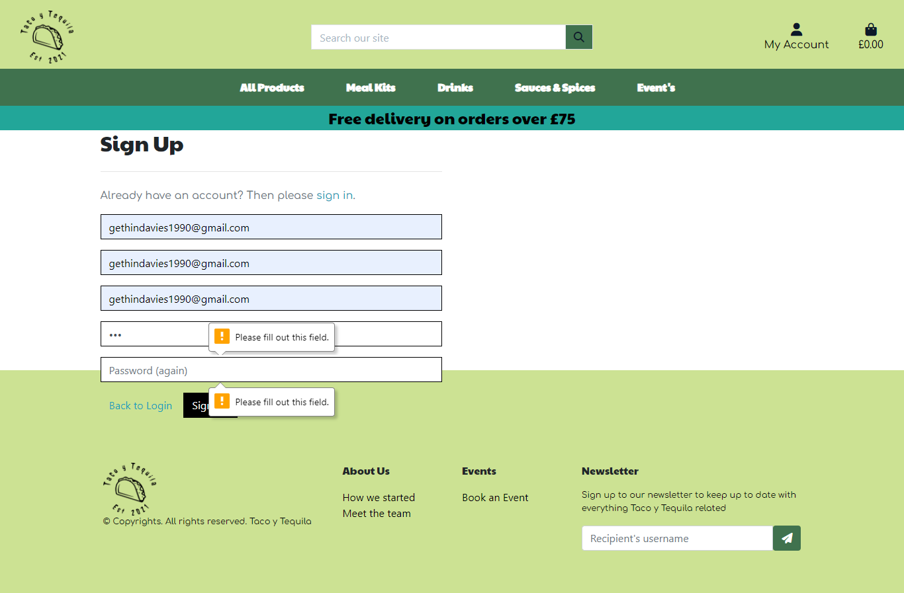
- A confirmation link is sent to the users email address, they must click on the verification link to verify the account.
<br>
- The user must confirm their email address
<br>
<br>
- Once that is done they can sign in to the website with their username/email address and password
#### User Stories feature 3
- User Story 3.1: As a regular user I can register on the website by providing an email address, email address(confirmation), username, password, password confirmation
- User Story 3.1: As a regular user I will receive an email to verify my account after registering
- User Story 3.1: As a regular user I can log in to my account once I click on the verification link in the email I receive regarding my registration

### Feature 4 Login
#### Description feature 4
- An admin/regular user can log in to the website using their username or email address and password
- Both fields are mandatory
- Once logged in the user will be navigated to the homepage
<br>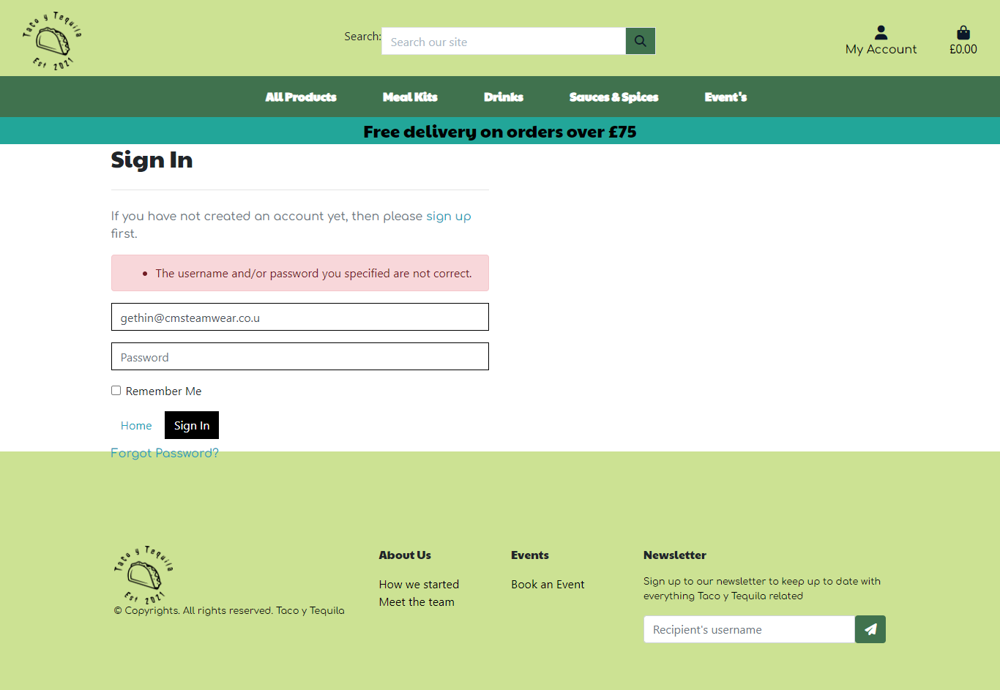
- The user must have an account in the system, and they must enter the correct  username or email address and password
- If the user needs to request a password, they can click on the Forgot Password link
<br>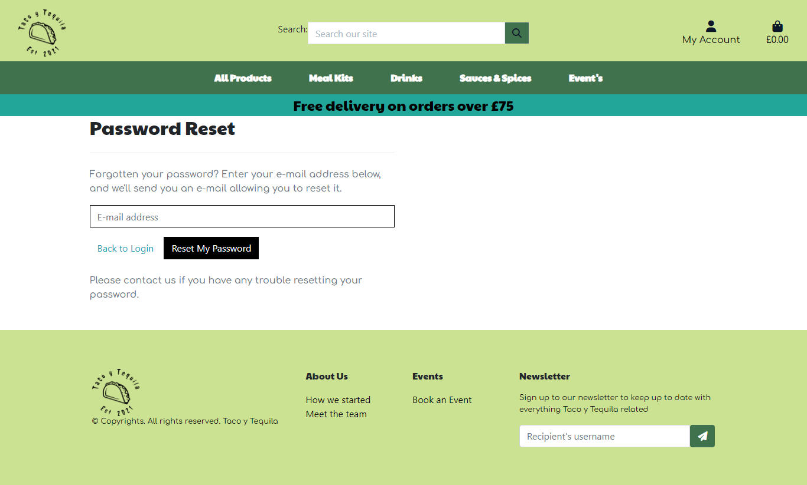
- They enter their email address, and they are emailed reset their password. Once they do this they can log in
<br>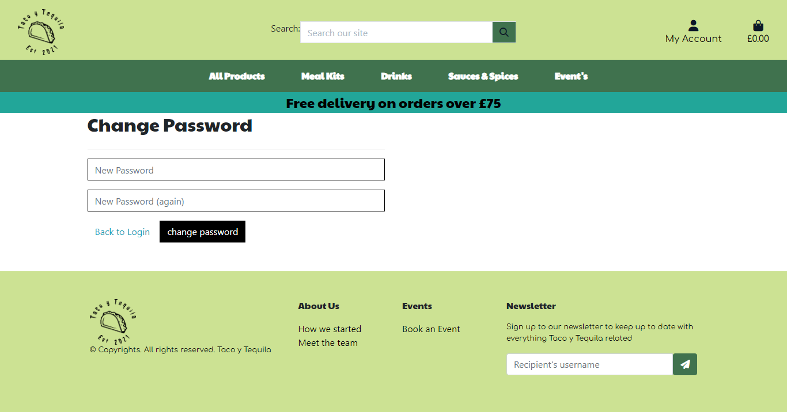
#### User Stories feature 4
- User Story 4.1: As an admin/regular user I can log in to the website using my username or email address and password. Both fields are mandatory. Once correct, I will be navigated to the homepage and a message displayed
- User Story 4.2: As an admin/regular user I can request a new password if I forget my current password. I will receive an email to reset my password. Once I reset I can log in

### Feature 5 Products and Product Detail Pages
#### Description feature 5
- A user view the products page with product count and with each product image, title, category, price and spice rating
<br>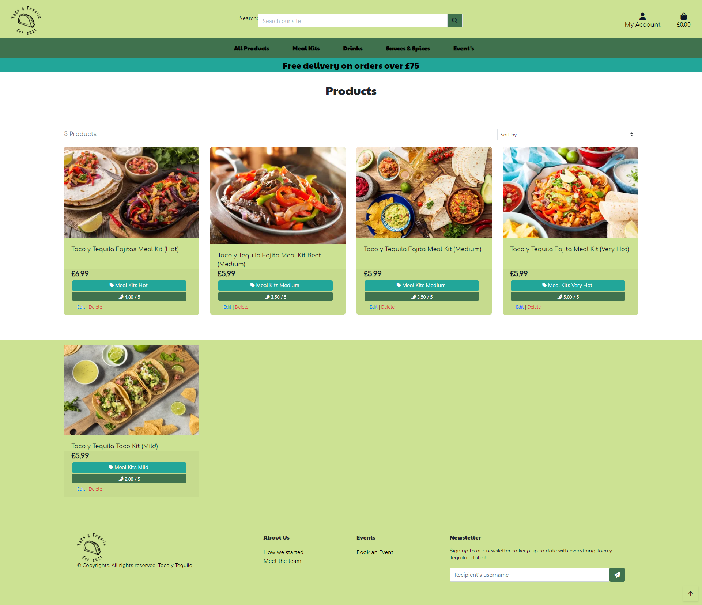
- The user can sort the products by Price(high to low, low to high), Spice Rating(high to low, low to high), Name(A-Z, Z-A), Category(A-Z, Z-A)
- A product detail page displays all the product information (image, description, sku, spice rating, category)
<br>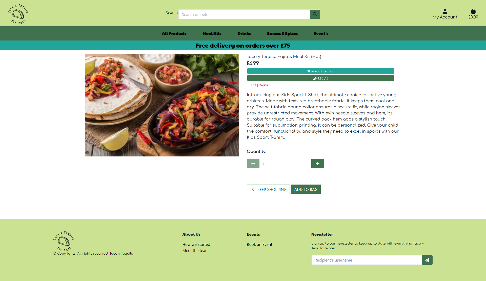

#### User Stories feature 5
- User Story 5.1: As a regular user I can view the products page with product count and with each product image, title, spice rating, category the product is in.
- User Story 5.2: As a regular user I can sort the products by Price(high to low, low to high), Spice Rating(high to low, low to high), Name(A-Z, Z-A), Category(A-Z, Z-A)
- User Story 5.3: As a regular user if I click on a product I will be navigated to the product detail page
- User Story 5.4: As a regular user I can view the product image, description, sku, spice rating, category
- User Story 5.5: As a regular user I can click on the Keep Shopping button on the product detail page, and it will navigate the user to the products page
- User Story 5.6: As a regular user I can set the product size(if applicable for the product) and quantity for a product (one plus)
- User Story 5.10: As an admin user I can view the Add product page by clicking on the Product Management link.
- User Story 5.11: As an admin user I can view the Edit product page by clicking on the Edit button on the product.
- User Story 5.12: As an admin user I can click on a product, and I am navigated to the product detail page. I can edit or delete the product by clicking on the Edit or Delete links on the page
- User Story 5.13: As an admin user I can delete a review a regular user has added

### Feature 6 Profile Page
#### Description feature 6
- A regular user can update their default delivery information as per the user stories below
- A use must be logged in to see their profile page
- This is the information that is displayed when the user is checking out an order
- A user can view and update their Default delivery information
<br>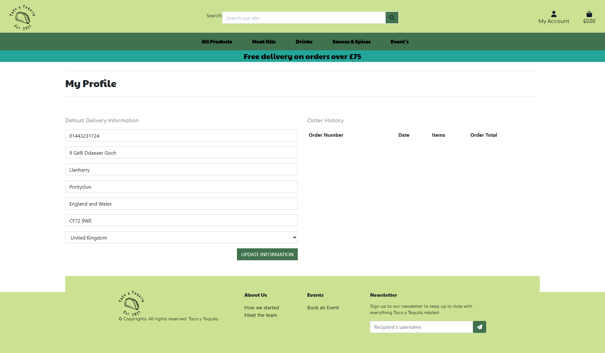
- The user can also view their past orders and click on an order to view the order details
<br>
- This data is consistent with the information they supplied when they made the order

- User Story 6.1: As a regular user I can view my Default delivery information: Phone Number, Street Address 1, Street Address 2, Town or City, County, State or Locality, Postal Code and Country
- User Story 6.2: As a regular user I can update my Default delivery information: Phone Number, Street Address 1, Street Address 2, Town or City, County, State or Locality, Postal Code and Country
- User Story 6.3: As a regular user I can view my order history(Order Number, Date, Items and Order Total)
- User Story 6.4: As a regular user I can click on an order number to view the order information (Order number, Order date/time, Full Name, Street Address 1, Street Address 2, Town or City, County, State or Locality, Postal Code and Country, Phone Number, Order Total, Deliver, Grand Total)
- User Story 7.1: As a regular user I can click on a product, set the size(if applicable) and quantity, click Add to Bag and the product will be added to my bag, a message

### Feature 7 Bag and Checkout
#### Description feature 7
- A user can add items to a bag, if the bag is empty a message is displayed
- A user can update the quantity or remove an item from their shopping bag
<br>
- An order over 75 pounds means free delivery. An order less than 75 incurs a 5% delivery charge
<br>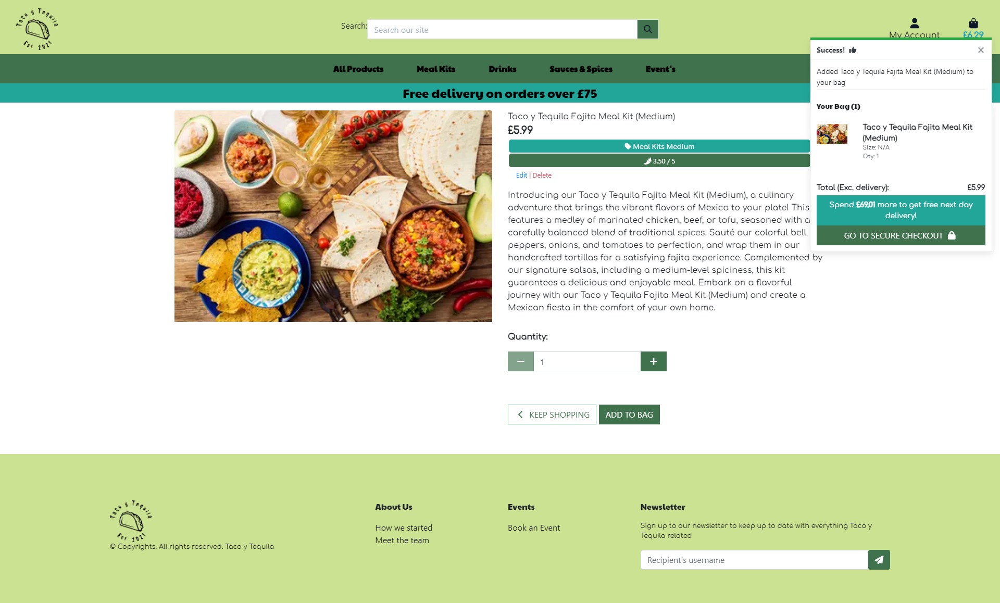
<br>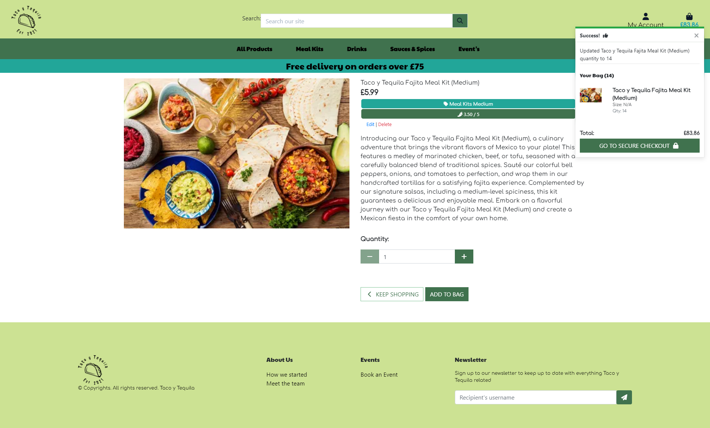
- The user can "checkout" and their details will be displayed.
- The fields are: (Full Name, email address, both mandatory) and Delivery Information: Phone Number(mandatory), Street Address 1(mandatory), Street Address 2, Town or City(mandatory, County, State or Locality, Postal Code and Country(mandatory)), which is populated from my profile if filled in
<br>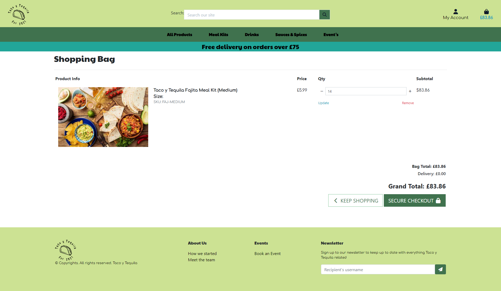
- The user receives a confirmation email to their email address supplied
<br>
- The order is available on the user profile page, and they can click on the order itself
<br>
- A regular user not logged in, I can add items to my bag and make a purchase
<br>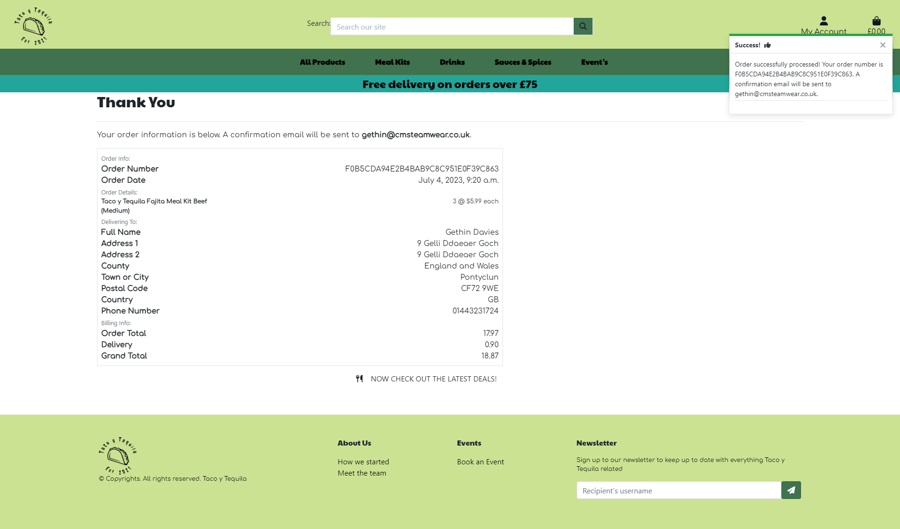

- User Story 7.1: As a regular user I can click on a product, set the size(if applicable) and quantity, click Add to Bag and the product will be added to my bag, a message displayed, and a toast will be displayed with the bag contents
- User Story 7.2: As a regular user I can click on the bag icon, I will be brought to my bag. If there are no items in the bag, a message will be displayed
- User Story 7.3: As a regular user I can click on the bag icon, I will be brought to my bag. If there are items, the product image, detail, price, quantity, subtotal will be displayed for the item. The bag total, delivery(if applicable), grand total would be displayed
- User Story 7.4: As a regular user I can update the quantity or remove an item from my shopping bag
- User Story 7.5: As a regular user I can click on the Secure Checkout button on the bag page or toast message, and I will be brought to the Checkout page
- User Story 7.6: As a regular user on the checkout page I can set my details(Full Name, email address, both mandatory) and Delivery Information(Phone Number(mandatory), Street Address 1(mandatory), Street Address 2, Town or City(mandatory, County, State or Locality, Postal Code and Country(mandatory), which is populated from my profile if filled in
- User Story 7.7: As a regular user on the checkout page I can view the order summary(item image, title, size, quantity, subtotal, order total, delivery, grand total)
- User Story 7.8: As a regular user on the checkout page if the order total is greater than 75 Pounds there is no delivery charge
- User Story 7.9: As a regular user on the checkout page if the order total is less than 75 pounds, there is delivery charge(5% of the order total) A message is displayed to the user on the toast message of what they need to add to the bag to avail of no delivery charge
- User Story 7.10: As a regular user on the checkout page if I click "Save this delivery information to my profile", the details entered will be saved on the users profile
- User Story 7.11: As a regular user on the checkout page I can enter a credit card number(16 digits), expiry date(2 digits/2digits) and a postal code(up to 5 digits), these fields are mandatory
- User Story 7.12: As a regular user on the checkout page if I click the Keep Shopping button I will be navigated to the products page
- User Story 7.13: As a regular user on the checkout page if I click the Complete Order button, and the transaction is not successful, a message will be displayed
- User Story 7.14: As a regular user on the checkout page if I click the Complete Order button, and the transaction is successful, the user will be navigated to a checkout success page, and an email is sent to the user
- User Story 7.15: As a regular user on the checkout page if I click the Complete Order button, and the transaction is successful, the order is saved to my order history in My profile page
- User Story 7.16: As a regular user on the checkout success page, the Order details will be displayed (Order number, Order date/time, Full NameStreet Address 1, Street Address 2, Town or City, County, State or Locality, Postal Code and Country, Phone Number, Order Total, Deliver, Grand Total) and a link to the sales item page is displayed
- User Story 7.17: As a regular user not logged in, I can add items to my bag and make a purchase