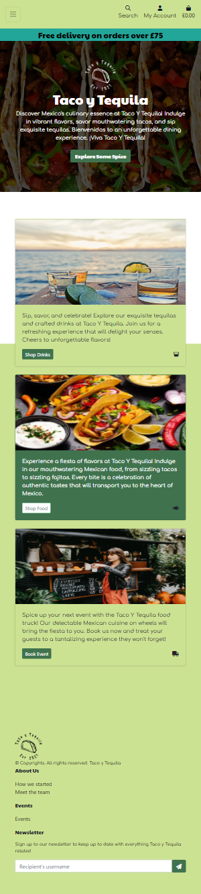
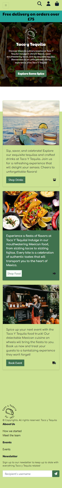
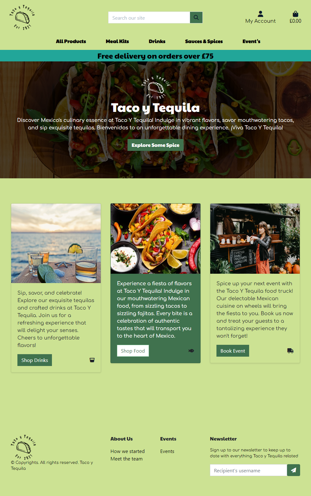
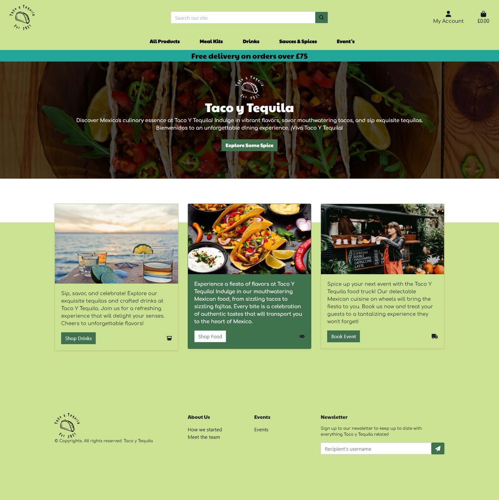
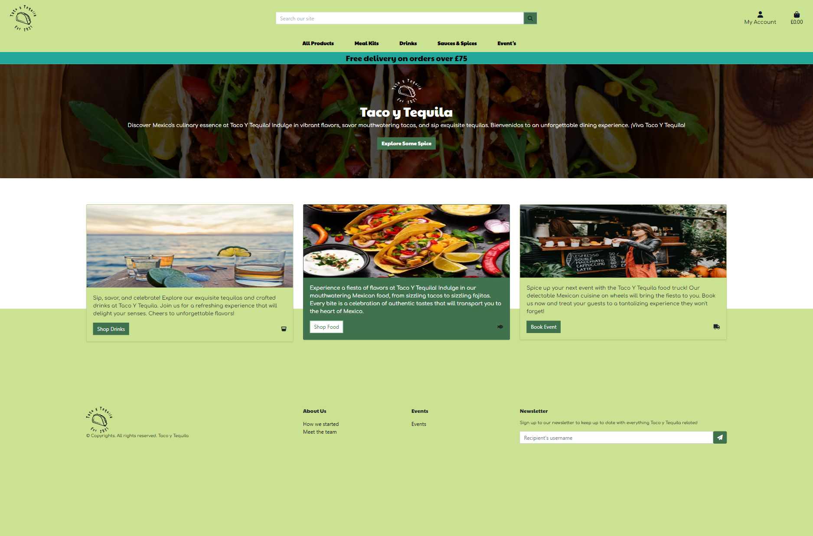
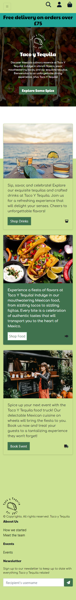
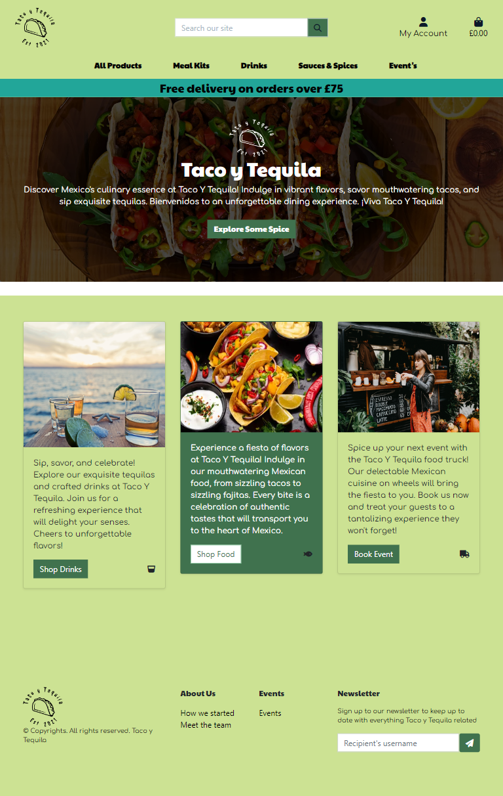

# Testing
The testing approach(described in detail in this testing readme) is as follows:
1. Automated unit testing using the Django unit test framework
2. Manual testing using emulators and real devices

Please Note- During the testing phase I used a google chrome extension called GOFullPage, whilst testing, the content on the page was displayed how i envisioned, but when taking the full page screenshot the image overlapped some content (on the screenshot only)

## Unit testing information
- I wrote a number of unit tests(INSERT NUMBER HERE) using the Django unit test framework
- These test cases are structured in a number of suites(INSERT NUMBERE HERE)
- The structure of the unit test is based on the model/form/view structure, for example test_views.py, test_model.py and test_forms.py on a per-app basis
- I used coverage(coverage.py) for code coverage and to ensure a high code coverage was met on all python files in the project
- An overall report image is available at the following link [Coverage Report](readme/misc/coverage_full_report.png)
- To run the unit tests click on Run "Test with Coverage" in your IDE, or at the command line "python manage.py test"
 
- A test database is created and deleted for the test run, and each suite has a set-up:<code>def setUp(self):</code> and teardown:<code>def tearDown(self):</code> methods to create
the relevant objects needed for the test suite
 

### Unit testing information for the Bag app
- For the bag app one suite was written to test the views
- The bag app does not have any forms or models
- The views' suite contains 8 unit tests testing add/removing items from the bag
 
- In terms of coverage when run as part of the 13 suites, it gives the following code coverage
 

### Unit testing information for the Checkout app
- For the checkout app three suites were written to test the views, form and models
- The suites contain 3 unit tests testing the order creation and forms
 
- In terms of coverage when run as part of the 13 suites, it gives the following code coverage
 

### Unit testing information for the Home app
- For the home app one suite was written to test the views
- The home app does not have any forms or models
- The suite contains 1 unit tests testing the home page template
 
- In terms of coverage when run as part of the 13 suites, it gives the following code coverage
 

### Unit testing information for the Products app
- For the product's app two suites were written to test the views and models
- The forms are tested as part of these suites
- The two suites contain 24 unit tests testing add/modify/views and delete of reviews and products
 
- In terms of coverage when run as part of the 13 suites, it gives the following code coverage
 

### Unit testing information for the Profile app
- For the product's app two suites were written to test the views and models
- The forms are tested as part of these suites
- The two suites contain 4 unit tests testing the users profile and profile updates
 
- In terms of coverage when run as part of the 13 suites, it gives the following code coverage
 

### Unit testing information for the Events App
- For the Events's app two suites were written to test the views and models
- The forms are tested as part of these suites
 
- In terms of coverage when run as part of the 13 suites, it gives the following code coverage
 

Device Number | Physical/Emulator | Device Name | Device Type | Browser |
------------ | ------------ | ------------- | ------------- | ------------- |
1 | Physical | Galaxy Note 3 | Phone |  Chrome |
2 | Physical | iPhone 8 | Mobile |Safari |
3 | Physical | Iphone 14 Pro | Mobile | Safari |
4 | Physical | Lenovo | Desktop | IE Edge |
5 | Physical | Macbook Pro 14 | Desktop | Mozilla Firefox |
6 | Physical | Imac | Desktop | Chrome |
7 | Emulator | Ipad Air | Tablet | Chrome |
8 | Emulator | Surface Pro 2 | Tablet | Chrome |
9 | Emulator | Pixel 2 | Tablet | Chrome |

## Responsiveness Testing

I made a very thorough check on responsiveness on all devices on the the google chrome emulator, and also on the physical devices I own personally which are stated in the table above.  Screen shots are included off all these devices below for each page.

### Homepage

Blackberry playbook - home

 

Blackberry Z30 - Home

 

Desktop 1000px - Home

 

Desktop 1600px - Home

 

Desktop 2500px - Home

 

Galaxy 8 - Home<

 

Galaxy Net Hub - Home

 

### Feature 1 Navigation & Homepage
#### Description feature 2
- User Story 1.1: As an admin/regular user the navigation bar is displayed with a logo on all pages with a search box, My account and shopping bag icons on a desktop device
- User Story 1.2: As an admin/regular user the navigation bar is displayed on all pages with a search box, My account and shopping bag icons on a mobile/tablet device
- User Story 1.3: As a regular user not logged in, I see a Register/Login link under the My Account dropdown
- User Story 1.4: As a regular user logged in/not logged in, I am brought to my shopping bag if I click on the Bag icon
- User Story 1.5: As a regular/admin user logged in, I see a "My Profile"/Logout under the My Account dropdown
- User Story 1.6: As a regular/admin user logged in, if I click on the My Profile under My Account I am brought to the My Profile page
- User Story 1.7: As a regular/admin user logged in, if I click on the My Profile under My Account I am brought to the Logout page. If I click Logout I am Logged out. If I click cancel I am brought back to the homepage
- User Story 1.8: As a regular/admin user I can view the Home link in the header, and clicking it will bring the user to the homepage
- User Story 1.9: As a regular/admin user I can click on the "All Products" filter, click By Price, and will be brought to the Products page, with products price low to high displayed
- User Story 1.10: As a regular/admin user I can click on the "All Products" filter, click By Rating, and will be brought to the Products page, with products rating high to low displayed
- User Story 1.11: As a regular/admin user I can click on the "All Products" filter, click By Category, and will be brought to the Products page, with products category a-z displayed
- User Story 1.12: As a regular/admin user I can click on the "Meal Kits" filer and filter by Mild, Medium, Hot, Very Hot, All Meal Kits
- User Story 1.13: As a regular/admin user I can click on the "Drinks" filter and filter by Tequila, Soft Drinks, Beers, All Drinks
- User Story 1.14: As a regular/admin user I can click on the "Sauces & Spices" filter and filter by Sauces, Spices
- User Story 1.15: As a regular/admin user I can click on the "Events" Tab and be directing to the events booking page.
- User Story 1.16: As a regular/admin user if I encounter an error on the site, I will be navigated to the applicable 400, 403, 404 or 500 error page

#### User Stories Steps 1
1. Navigate to https://taco-y-tequila-c6ff831b9a3a.herokuapp.com, and click on the My Account link as a regular user
2. Login to the website with a valid username and password, and click on the My Account link
3. Navigate to the "All Products" filter, and then click By Price
4. Navigate to the "All Products" filter, and then click By Spice Rating
5. Navigate to the "All Products" filter, and then click By Category
6. Navigate to the "Meal Kits" filter, and filter by Adidas 'Mild'
7. Navigate to the "Drinks" filter, and filter by 'Tequila'
8. Navigate to the "Sauces & Spices" filter, and filter by 'Spices'
9. Navigate to the page https://taco-y-tequila-c6ff831b9a3a.herokuapp.com/nosuchpage
10. Click the Logout link under My profile and logout
11. Login as an admin user

#### User Story Testing Results 1
Step| Result | Desktop | Tablet | Mobile | Status
------------ | ------------ | ------------- | ------------- | ------------- | -------------
Step 1 | The homepage is displayed, Login and Register links are displayed under My Account | [Desktop](readme/testing/feature_1/feature-1-step1-desktop.png)  | [Tablet](readme/testing/feature_1/feature-1-step1-tablet.png)  | [Mobile](readme/testing/feature_1/feature-1-step1-mobile.png)  | Passed |
Step 2 | The homepage is displayed with a header logo(desktop), search box(expands on tablet/mobile), My account and shopping bag icons. My Profile/Logout is visible under My Account.   | [Desktop](readme/testing/feature_1/feature-1-step2-desktop.png)  | [Tablet](readme/testing/feature_1/feature-1-step2-tablet.png)  | [Mobile](readme/testing/feature_1/feature-1-step2-mobile.png)  | Passed |
Step 3 | Products on the page are filtered by Price (Low-High) | [Desktop](readme/testing/feature_1/feature-1-step3-desktop.png)  | [Tablet](readme/testing/feature_1/feature-1-step3-tablet.png)  | [Mobile](readme/testing/feature_1/feature-1-step3-mobile.png)  | Passed |
Step 4 | Products on the page are filtered by Rating (High-Low) | [Desktop](readme/testing/feature_1/feature-1-step4-desktop.png)  | [Tablet](readme/testing/feature_1/feature-1-step4-tablet.png)  | [Mobile](readme/testing/feature_1/feature-1-step4-mobile.png)  | Passed |
Step 5 | Products on the page are filtered by Category (A-Z) | [Desktop](readme/testing/feature_1/feature-1-step5-desktop.png)  | [Tablet](readme/testing/feature_1/feature-1-step5-tablet.png)  | [Mobile](readme/testing/feature_1/feature-1-step5-mobile.png)  | Passed |

### Feature 2 Footer
#### Description feature 2
- User Story 2.1: As a regular user the footer is displayed with a logo, 'About us links', 'Events' and 'Newsletter' sign up
- User Story 2.2: As a regular user I can sign up for a newsletter by entering my email address and clicking Signup. I will receive an email after signing up

#### User Stories Steps 1
1. As a regular/admin user scroll down to the footer on the homepage

#### User Story Testing Results 1
Step| Result | Desktop | Tablet | Mobile | Status
------------ | ------------ | ------------- | ------------- | ------------- | -------------
Step 1 | The homepage is displayed, Login and Register links are displayed under My Account | [Desktop](readme/testing/feature_2/feature-2-step2-desktop.png)  | [Tablet](readme/testing/feature_2/feature-2-step1-tablet.png)  | [Mobile](readme/testing/feature_2/feature-2-step1-mobile.png)  | Passed |

### Feature 3 Register
#### Description feature 3
- User Story 3.1: As a regular user I can register on the website by providing an email address, email address(confirmation), username, password, password confirmation
- User Story 3.1: As a regular user I will receive an email to verify my account after registering
- User Story 3.1: As a regular user I can log in to my account once I click on the verification link in the email I receive regarding my registration

#### User Stories Steps 1
1. As a regular user, navigate to the registration page, fill in email address, email address(confirmation), username, password, password confirmation and click Sign Up
2. Open the email received
3. Click on the verification link in the email received

#### User Story Testing Results 1
Step| Result | Desktop | Tablet | Mobile | Status
------------ | ------------ | ------------- | ------------- | ------------- | -------------
Step 1 | User registers for an account | [Desktop](readme/testing/feature_4/feature-3-step1-desktop.png)  | [Tablet](readme/testing/feature_3/feature-3-step1-tablet.png)  | [Mobile](readme/testing/feature_3/feature-3-step1-mobile.png)  | Passed |
Step 2 | User registers for an account | [Desktop](readme/testing/feature_3/feature-3-step2-desktop.png)  | [Tablet](readme/testing/feature_3/feature-3-step2-tablet.png)  | [Mobile](readme/testing/feature_3/feature-3-step2-mobile.png)  | Passed |
Step 3 | User registers for an account | [Desktop](readme/testing/feature_3/feature-3-step3-desktop.png)  | [Tablet](readme/testing/feature_3/feature-3-step3-desktop.png)  | [Mobile](readme/testing/feature_3/feature-3-step3-desktop.png)  | Passed |

### Feature 4 Login
#### Description feature 4
- User Story 4.1: As an admin/regular user I can log in to the website using my username or email address and password. Both fields are mandatory. Once correct, I will be navigated to the homepage and a message displayed
- User Story 4.2: As an admin/regular user I can request a new password if I forget my current password. I will receive an email to reset my password. Once I reset I can log in

#### User Stories Steps 1
1. Attempt to log in to the website with an account that does not exist or an incorrect password
2. Request a new password
3. Login to the site with the correct account details

#### User Story Testing Results 1
Step| Result | Desktop | Tablet | Mobile | Status
------------ | ------------ | ------------- | ------------- | ------------- | -------------
Step 1 | A message is displayed to the user | [Desktop](readme/testing/feature_4/feature-4-step1-desktop.png)  | [Tablet](readme/testing/feature_4/feature-4-step1-tablet.png)  | [Mobile](readme/testing/feature_4/feature-4-step1-mobile.png)  | Passed |
Step 2 | The user receives an email where they can reset their password | [Desktop](readme/testing/feature_4/feature-4-step2-desktop.png)  | [Tablet](readme/testing/feature_4/feature-4-step2-desktop.png)  | [Mobile](readme/testing/feature_4/feature-4-step2-desktop.png)  | Passed |
Step 3 | The user can successfully log in | [Desktop](readme/testing/feature_4/feature-4-step3-desktop.png)  | [Tablet](readme/testing/feature_4/feature-4-step3-tablet.png)  | [Mobile](readme/testing/feature_4/feature-4-step3-mobile.png)  | Passed |

### Feature 5 Login
#### Description feature 5
- User Story 5.1: As a regular user I can view the products page with product count and with each product image, title, spice rating, category the product is in.
- User Story 5.2: As a regular user I can sort the products by Price(high to low, low to high), Spice Rating(high to low, low to high), Name(A-Z, Z-A), Category(A-Z, Z-A)
- User Story 5.3: As a regular user if I click on a product I will be navigated to the product detail page
- User Story 5.4: As a regular user I can view the product image, description, sku, spice rating, category
- User Story 5.5: As a regular user I can click on the Keep Shopping button on the product detail page, and it will navigate the user to the products page
- User Story 5.6: As a regular user I can set the product size(if applicable for the product) and quantity for a product (one plus)
- User Story 5.10: As an admin user I can view the Add product page by clicking on the Product Management link.
- User Story 5.11: As an admin user I can view the Edit product page by clicking on the Edit button on the product.
- User Story 5.12: As an admin user I can click on a product, and I am navigated to the product detail page. I can edit or delete the product by clicking on the Edit or Delete links on the page
- User Story 5.13: As an admin user I can delete a review a regular user has added

#### User Stories Steps 1
1. As a regular user login to the website and navigate to the products page
2. Sort the products from Price(High to Low)
3. Click on a product
4. Add a product
5. As an admin user login and click on the add product(Product Management)
6. Click on the edit button on the products page or in the product detail page and edit the product

#### User Story Testing Results 1
Step| Result | Desktop | Tablet | Mobile | Status
------------ | ------------ | ------------- | ------------- | ------------- | -------------
Step 1 | The products page is displayed | [Desktop](readme/testing/feature_5/feature-5-step1-desktop.png)  | [Tablet](readme/testing/feature_5/feature-5-step1-tablet.png)  | [Mobile](readme/testing/feature_5/feature-5-step1-mobile.png)  | Passed |
Step 2 | The products are sorted High to Low | [Desktop](readme/testing/feature_5/feature-5-step2-desktop.png)  | [Tablet](readme/testing/feature_5/feature-5-step2-tablet.png)  | [Mobile](readme/testing/feature_5/feature-5-step2-mobile.png)  | Passed |
Step 3 | The product detail is displayed | [Desktop](readme/testing/feature_5/feature-5-step3-desktop.png)  | [Tablet](readme/testing/feature_5/feature-5-step3-tablet.png)  | [Mobile](readme/testing/feature_5/feature-5-step3-mobile.png)  | Passed |
Step 4 | The add product page is displayed | [Desktop](readme/testing/feature_5/feature-5-step4-desktop.png)  | [Tablet](readme/testing/feature_5/feature-5-step4-tablet.png)  | [Mobile](readme/testing/feature_5/feature-5-step4-mobile.png)  | Passed |
Step 5 | The edit product page is displayed | [Desktop](readme/testing/feature_5/feature-5-step5-desktop.png)  | [Tablet](readme/testing/feature_5/feature-5-step5-tablet.png)  | [Mobile](readme/testing/feature_5/feature-5-step5-mobile.png)  | Passed |

### Feature 6 Profile
#### Description feature 6
- User Story 6.1: As a regular user I can view my Default delivery information: Phone Number, Street Address 1, Street Address 2, Town or City, County, State or Locality, Postal Code and Country
- User Story 6.2: As a regular user I can update my Default delivery information: Phone Number, Street Address 1, Street Address 2, Town or City, County, State or Locality, Postal Code and Country
- User Story 6.3: As a regular user I can view my order history(Order Number, Date, Items and Order Total)
- User Story 6.4: As a regular user I can click on an order number to view the order information (Order number, Order date/time, Full Name, Street Address 1, Street Address 2, Town or City, County, State or Locality, Postal Code and Country, Phone Number, Order Total, Deliver, Grand Total)

#### User Stories Steps 1
1. Click on the My Profile link under My Account
2. Update one field in the default delivery information (Street Address 2)
3. Click on an order number

#### User Story Testing Results 1
Step| Result | Desktop | Tablet | Mobile | Status
------------ | ------------ | ------------- | ------------- | ------------- | -------------
Step 1 | The users default delivery information and order history is displayed | [Desktop](readme/testing/feature_6/feature-6-step1-desktop.png)  | [Tablet](readme/testing/feature_6/feature-6-step1-tablet.png)  | [Mobile](readme/testing/feature_6/feature-6-step1-mobile.png)  | Passed |
Step 2 | The users default delivery information is updated and displayed (Street Address 2) | [Desktop](readme/testing/feature_6/feature-6-step2-desktop.png)  | [Tablet](readme/testing/feature_6/feature-6-step2-tablet.png)  | [Mobile](readme/testing/feature_6/feature-6-step2-mobile.png)  | Passed |
Step 3 | The users order details is displayed | [Desktop](readme/testing/feature_6/feature-6-step3-desktop.png)  | [Tablet](readme/testing/feature_6/feature-6-step3-tablet.png)  | [Mobile](readme/testing/feature_6/feature-6-step3-mobile.png)  | Passed |

### Feature 7 Bag And checkout
#### Description feature 7
- User Story 7.1: As a regular user I can click on a product, set the size(if applicable) and quantity, click Add to Bag and the product will be added to my bag, a message displayed, and a toast will be displayed with the bag contents
- User Story 7.2: As a regular user I can click on the bag icon, I will be brought to my bag. If there are no items in the bag, a message will be displayed
- User Story 7.3: As a regular user I can click on the bag icon, I will be brought to my bag. If there are items, the product image, detail, price, quantity, subtotal will be displayed for the item. The bag total, delivery(if applicable), grand total would be displayed
- User Story 7.4: As a regular user I can update the quantity or remove an item from my shopping bag
- User Story 7.5: As a regular user I can click on the Secure Checkout button on the bag page or toast message, and I will be brought to the Checkout page
- User Story 7.6: As a regular user on the checkout page I can set my details(Full Name, email address, both mandatory) and Delivery Information(Phone Number(mandatory), Street Address 1(mandatory), Street Address 2, Town or City(mandatory, County, State or Locality, Postal Code and Country(mandatory), which is populated from my profile if filled in
- User Story 7.7: As a regular user on the checkout page I can view the order summary(item image, title, size, quantity, subtotal, order total, delivery, grand total)
- User Story 7.8: As a regular user on the checkout page if the order total is greater than 75 Pounds there is no delivery charge
- User Story 7.9: As a regular user on the checkout page if the order total is less than 75 pounds, there is delivery charge(5% of the order total) A message is displayed to the user on the toast message of what they need to add to the bag to avail of no delivery charge
- User Story 7.10: As a regular user on the checkout page if I click "Save this delivery information to my profile", the details entered will be saved on the users profile
- User Story 7.11: As a regular user on the checkout page I can enter a credit card number(16 digits), expiry date(2 digits/2digits) and a postal code(up to 5 digits), these fields are mandatory
- User Story 7.12: As a regular user on the checkout page if I click the Keep Shopping button I will be navigated to the products page
- User Story 7.13: As a regular user on the checkout page if I click the Complete Order button, and the transaction is not successful, a message will be displayed
- User Story 7.14: As a regular user on the checkout page if I click the Complete Order button, and the transaction is successful, the user will be navigated to a checkout success page, and an email is sent to the user
- User Story 7.15: As a regular user on the checkout page if I click the Complete Order button, and the transaction is successful, the order is saved to my order history in My profile page
- User Story 7.16: As a regular user on the checkout success page, the Order details will be displayed (Order number, Order date/time, Full NameStreet Address 1, Street Address 2, Town or City, County, State or Locality, Postal Code and Country, Phone Number, Order Total, Deliver, Grand Total) and a link to the sales item page is displayed
- User Story 7.17: As a regular user not logged in, I can add items to my bag and make a purchase

#### User Stories Steps 1
1. As a regular user add some items to your bag, so the order is less than 99 euros
2. Empty the bag
3. Add the items back into the bag, and Update the quantity on one item by one, so the order goes above 75 pound
4. Checkout the order

#### User Story Testing Results 1
Step| Result | Desktop | Tablet | Mobile | Status
------------ | ------------ | ------------- | ------------- | ------------- | -------------
Step 1 | The items are added to the bag, and there is a delivery charge(5%) and message displayed | [Desktop](readme/testing/feature_7/feature-7-step1-desktop.png)  | [Tablet](readme/testing/feature_7/feature-7-step1-tablet.png)  | [Mobile](readme/testing/feature_7/feature-7-step1-mobile.png)  | Passed |
Step 2 | A message "Your bag is empty" is displayed with a button to go shopping | [Desktop](readme/testing/feature_7/feature-7-step2-desktop.png)  | [Tablet](readme/testing/feature_7/feature-7-step2-tablet.png)  | [Mobile](readme/testing/feature_7/feature-7-step2-mobile.png)  | Passed |
Step 3 | The items are added to the bag, and there is no delivery charge | [Desktop](readme/testing/feature_7/feature-7-step3-desktop.png)  | [Tablet](readme/testing/feature_7/feature-7-step3-tablet.png)  | [Mobile](readme/testing/feature_7/feature-7-step3-mobile.png)| Passed |
Step 4 | The user receives a success toast notify the order is confirmed | [Desktop](readme/testing/feature_7/feature-7-step4-desktop.png)  | [Tablet](readme/testing/feature_7/feature-7-step4-tablet.png)  | [Mobile](readme/testing/feature_7/feature-7-step4-mobile.png)  | Passed |

### Feature 8 Admin

#### User Story 8.7
- 8.7: As an admin user I can view users orders in the django admin page and can view order number, date, full name, order total, delivery cost, grand total
#### User Story Steps 8.7
- Step 1: As an admin user login navigate to https://taco-y-tequila-c6ff831b9a3a.herokuapp.com/admin/checkout/order/
#### User Story Testing Results 8.7
Step| Result | Result  | Status
------------ | ------------ | ------------- | -------------
Step 1 | The orders are displayed | [Result](readme/testing/feature_8/feature-8-8.7.png)  | Passed |

#### User Story 8.8
- User Story 8.8: As an admin user I can view products in the django admin page and can view search and filter by sku, category, name and price
#### User Story Steps 8.8
- Step 1: As an admin user login navigate to https://taco-y-tequila-c6ff831b9a3a.herokuapp.com/admin/products/product/
#### User Story Testing Results 8.8
Step| Result | Result  | Status
------------ | ------------ | ------------- | -------------
Step 1 | The orders are displayed | [Result](readme/testing/feature_8/feature-8-8.8.png)  | Passed |

#### User Story 8.9
- User Story 8.9: As an admin user I can view users in the django admin page and can view their username, email address, first name, last name, staff status
#### User Story Steps 8.9
- Step 1: As an admin user login navigate to https://taco-y-tequila-c6ff831b9a3a.herokuapp.com/admin/auth/user/
#### User Story Testing Results 8.9
Step| Result | Result  | Status
------------ | ------------ | ------------- | -------------
Step 1 | The orders are displayed | [Result](readme/testing/feature_8/feature-8-8.9.png)  | Passed |

#### User Story 8.10
- User Story 8.10: As an admin user I can view users in the django admin page and can search by username and email address and  filter by staff status, superuser status and active status
#### User Story Steps 8.10
- Step 1: As an admin user login navigate to https://taco-y-tequila-c6ff831b9a3a.herokuapp.com/admin/auth/user/
#### User Story Testing Results 8.10
Step| Result | Result  | Status
------------ | ------------ | ------------- | -------------
Step 1 | The orders are displayed | [Result](readme/testing/feature_8/feature-8-8.9.png)  | Passed |

#### User Story 8.11
- User Story 8.11: As an admin user I can view users in the django admin page and can search by username and email address and  filter by staff status, superuser status and active status
#### User Story Steps 8.11
- Step 1: As an admin user login navigate to https://taco-y-tequila-c6ff831b9a3a.herokuapp.com/admin/products/category/
#### User Story Testing Results 8.11
Step| Result | Result  | Status
------------ | ------------ | ------------- | -------------
Step 1 | The orders are displayed | [Result](readme/testing/feature_8/feature-8-8.11.png)  | Passed |

# Bugs found during the testing phase

Bug no. | Bug description |  Bug fix |
------------ | ------------- | ------------- |
1 | When manually testing adding of products, I couldn't add products with images | The fix was in my admin panel in my django application, I didn't have the correct permissions set for the user.
2 | I noticed on testing some buttons were the default boot strap and not how I styled them | Overridden the styles in the base.css
3 | The webhook handler is not firing when an order is successful | LOOKING INTO
4 | A lot of responsive issues on mobile | added more media queries tt fix this

# Code Validators and Website Analysis
The website's pages was tested against the following validators:

## HTML Markup Validation Service
I used https://validator.w3.org/ to validate the html files

Page | Result | Test Detail/Screenshot
------------ | ------------- | -------------
add_product.html  | 0 errors | [Results](readme/validation/html_validation/add_product.png)
bag.html  | 0 errors | [Results](readme/validation/html_validation/bag.png)
book_event.html  | 0 errors | [Results](readme/validation/html_validation/book_event.png)
checkout_success.html  | 0 errors | [Results](readme/validation/html_validation/checkout_success.png)
checkout.html  | 0 errors | [Results](readme/validation/html_validation/checkout.png)
edit_product.html  | 0 errors | [Results](readme/validation/html_validation/edit_product.png)
event_booked.html  | 0 errors | [Results](readme/validation/html_validation/event_booked.png)
how_we_started.html  | 0 errors | [Results](readme/validation/html_validation/how_we_started.png)
index.html  | 0 errors | [Results](readme/validation/html_validation/index.png)
meet_the_team.html  | 0 errors | [Results](readme/validation/html_validation/meet_the_team.png)
product_detail.html  | 0 errors | [Results](readme/validation/html_validation/product_detail.png)
profile.html  | 0 errors | [Results](readme/validation/html_validation/profile.png)

 

## CSS Validation Service
I used https://jigsaw.w3.org/css-validator/ to validate the css(style.css)

    

 

Page | Result | Test Detail/Screenshot
------------ | ------------- | -------------
static/css/base.css | Passed, No errors found | [Results](readme/validation/css_validation/base.png)
checkout/static/checkout/css/checkout.css | Passed, No errors found | [Results](readme/validation/css_validation/checkout.png)

## JSHint
- JSHint(https://jshint.com/) was used to analyse the Javascript files

Page | Result | Test Detail/Screenshot
------------ | ------------- | -------------
checkout/static/checkout/stripe_element.js | 0 errors and 0 warnings | [Results](readme/validation/jshint/stripe.png)
products/static/products/products.js | 0 errors and 0 warnings | [Results](readme/validation/jshint/products.png)
static/js/toast.js | 0 errors and 0 warnings | [Results](readme/validation/jshint/toast.png)
static/js/send_email.js | 0 errors and 0 warnings | [Results](readme/validation/jshint/send_email.png)

 

## Python Validation - Code Institute
- One of the main errors on several files was to ensure the character count was less than 80 characters, these were present in the files I had not much control over, Stripe etc.

Page | Result
------------ | -------------
bag/apps.py | No errors/warnings | [Results](readme/validation/pep8_validation/bag_apps.png)
bag/contexts.py | No errors/warnings | [Results](readme/validation/pep8_validation/bag_contexts.png)
bag/urls.py | No errors/warnings | [Results](readme/validation/pep8_validation/bag_urls.png)
bag/views.py | No errors/warnings | [Results](readme/validation/pep8_validation/bag_views.png)
checkout/admin.py | No errors/warnings | [Results](readme/validation/pep8_validation/checkout_admin.png)
checkout/apps.py | No errors/warnings [Results](readme/validation/pep8_validation/checkout_apps.png)
checkout/forms.py | No errors/warnings [Results](readme/validation/pep8_validation/checkout_forms.png)
checkout/models.py | No errors/warnings [Results](readme/validation/pep8_validation/checkout_models.png)
checkout/signals.py | No errors/warnings [Results](readme/validation/pep8_validation/checkout_signals.png)
checkout/urls.py | No errors/warnings [Results](readme/validation/pep8_validation/checkout_urls.png)
checkout/views.py | No errors/warnings [Results](readme/validation/pep8_validation/checkout_views.png)
checkout/webhook_handler.py | No errors/warnings [Results](readme/validation/pep8_validation/checkout_webhook_handler.png)
checkout/webhooks.py | No errors/warnings [Results](readme/validation/pep8_validation/checkout_webhooks.png)
home/apps.py | No errors/warnings [Results](readme/validation/pep8_validation/home_apps.png)
home/urls.py | No errors/warnings [Results](readme/validation/pep8_validation/home_urls.png)
home/views.py | No errors/warnings [Results](readme/validation/pep8_validation/home_views.png)
products/admin.py | No errors/warnings [Results](readme/validation/pep8_validation/products_admin.png)
products/apps.py | No errors/warnings [Results](readme/validation/pep8_validation/products_apps.png)
products/forms.py | No errors/warnings [Results](readme/validation/pep8_validation/products_forms.png)
products/models.py | No errors/warnings [Results](readme/validation/pep8_validation/products_models.png)
products/urls.py | No errors/warnings [Results](readme/validation/pep8_validation/products_urls.png)
products/views.py | No errors/warnings [Results](readme/validation/pep8_validation/products_views.png)
products/widgets.py | No errors/warnings [Results](readme/validation/pep8_validation/products_widgets.png)
profiles/apps.py | No errors/warnings [Results](readme/validation/pep8_validation/profiles_apps.png)
profiles/forms.py | No errors/warnings [Results](readme/validation/pep8_validation/profiles_forms.png)
profiles/models.py | No errors/warnings [Results](readme/validation/pep8_validation/profiles_models.png)
profiles/urls.py | No errors/warnings [Results](readme/validation/pep8_validation/profiles_urls.png)
profiles/views.py | No errors/warnings [Results](readme/validation/pep8_validation/profiles_views.png)
events/admin | No errors/warnings [Results](readme/validation/pep8_validation/events_admin.png)
events/models | No errors/warnings [Results](readme/validation/pep8_validation/events_models.png)
events/apps | No errors/warnings [Results](readme/validation/pep8_validation/events_apps.png)
events/urls | No errors/warnings [Results](readme/validation/pep8_validation/events_urls.png)
events/views | No errors/warnings [Results](readme/validation/pep8_validation/events_views.png)
taco_y_tequila/asgi | No errors/warnings [Results](readme/validation/pep8_validation/taco_y_tequila_asgi.png)
taco_y_tequila/settings | No errors/warnings [Results](readme/validation/pep8_validation/taco_y_tequila_settings.png)
taco_y_tequila/urls | No errors/warnings [Results](readme/validation/pep8_validation/taco_y_tequila_urls.png)
taco_y_tequila/views | No errors/warnings [Results](readme/validation/pep8_validation/taco_y_tequila_views.png)
taco_y_tequila/wsgi | No errors/warnings [Results](readme/validation/pep8_validation/taco_y_tequila_wsgi.png)
custom_storages.py | No errors/warnings [Results](readme/validation/pep8_validation/profiles_views.png)

## Chrome Dev tools Lighthouse

- I used Lighthouse (https://developers.google.com/web/tools/lighthouse) to test the performance, seo, best practices and accessibility of the site
- Overall the results are very good for the 4 values: Performance, Accessibility, Best Practices and SEO

### Desktop
Page  | Performance (%) | Accessibility (%) | Best Practices (%) | SEO (%)
------------  | ------------ | ------------- | ------------- | -------------
bag/templates/bag/bag.html | 95 | 100 | 92 | 100 |
checkout/templates/checkout/checkout.html | 91 | 100 | 92 | 100 |
checkout/templates/checkout/checkout_success.html | 93 | 100 | 92 | 100 |
home/templates/home/index.html | 92 | 100 | 83 | 100 ||
products/templates/products/add_product.html | 94 | 100 | 92 | 100 |
<!-- products/templates/products/edit_product.html | 96 | 78 | 92 | 90 | -->
products/templates/products/product_detail.html | 96 | 100 | 83 | 100 |
products/templates/products/products.html  | 91 | 97 | 92 | 90 |
profile/templates/profile/profile.html | 94 | 100 | 92 | 100 |
profile/templates/profile/order_history.html | 93 | 100 | 92 | 100 |
templates/allauth/account/login.html | 90 | 100 | 92 | 100 |
templates/allauth/account/logout.html | 95 | 100 | 92 | 100 |
templates/allauth/account/register.html | 96 | 100 | 92 | 100 |

### Mobile
Page  | Performance (%) | Accessibility (%) | Best Practices (%) | SEO (%)
------------  | ------------ | ------------- | ------------- | -------------
bag/templates/bag/bag.html | 95 | 100 | 92 | 100 |
checkout/templates/checkout/checkout.html | 91 | 100 | 92 | 100 |
checkout/templates/checkout/checkout_success.html | 93 | 100 | 92 | 100 |
home/templates/home/index.html | 92 | 100 | 83 | 100 ||
products/templates/products/add_product.html | 94 | 100 | 92 | 100 |
<!-- products/templates/products/edit_product.html | 96 | 78 | 92 | 90 | -->
products/templates/products/product_detail.html | 96 | 100 | 83 | 100 |
products/templates/products/products.html  | 91 | 97 | 92 | 90 |
profile/templates/profile/profile.html | 94 | 100 | 92 | 100 |
profile/templates/profile/order_history.html | 93 | 100 | 92 | 100 |
templates/allauth/account/login.html | 90 | 100 | 92 | 100 |
templates/allauth/account/logout.html | 95 | 100 | 92 | 100 |
templates/allauth/account/register.html | 96 | 100 | 92 | 100 |

## Wave Accessibility
- Wave accessibility(https://wave.webaim.org/) was used to test the websites accessibility

Page | Result | Test Detail/Screenshot
------------ | ------------- | -------------
bag/templates/bag/bag.html  | 0 errors and 0 contrast errors| [Results](readme/validation/wave/bag_full.png)
bag/templates/bag/bag.html (empty) | 0 errors and 0 contrast errors| [Results](readme/validation/wave/bag.png)
checkout/templates/checkout/checkout.html | 0 errors and 0 contrast errors| [Results](readme/validation/wave/checkout.png)
checkout/templates/checkout/checkout_success.html | 0 errors and 0 contrast errors| [Results](readme/validation/wave/checkout_success.png)
home/templates/home/index.html | 0 errors and 0 contrast errors| [Results](readme/validation/wave/index.png)
products/templates/products/add_product.html | 0 errors and 0 contrast errors| [Results](readme/validation/wave/add_product.png)
products/templates/products/edit_product.html | 0 errors and 0 contrast errors| [Results](readme/validation/wave/edit_product.png)
products/templates/products/product_detail.html | 0 errors and 0 contrast errors| [Results](readme/validation/wave/product_detail.png)
profile/templates/profile/profile.html | 0 errors and 0 contrast errors| [Results](readme/validation/wave/profile.png)
profile/templates/profile/order_history.html | 0 errors and 0 contrast errors| [Results](readme/validation/wave/bag.png)
info/templates/how_we_started.html | 0 errors and 0 contrast errors| [Results](readme/validation/wave/order_history.png)
info/templates/meet_the_team.html | 0 errors and 0 contrast errors| [Results](readme/validation/wave/meet_the_team.png)
events/templates/book_event.html | 0 errors and 0 contrast errors| [Results](readme/validation/wave/book_event.png)
events/templates/book_event.html | 0 errors and 0 contrast errors| [Results](readme/validation/wave/event_booked.png)
templates/allauth/account/login.html | 0 errors and 0 contrast errors| [Results](readme/validation/wave/sign_in.png)
templates/allauth/account/logout.html | 0 errors and 0 contrast errors| [Results](readme/validation/wave/sign_out.png)
templates/allauth/account/register.html | 0 errors and 0 contrast errors| [Results](readme/validation/wave/register.png)
